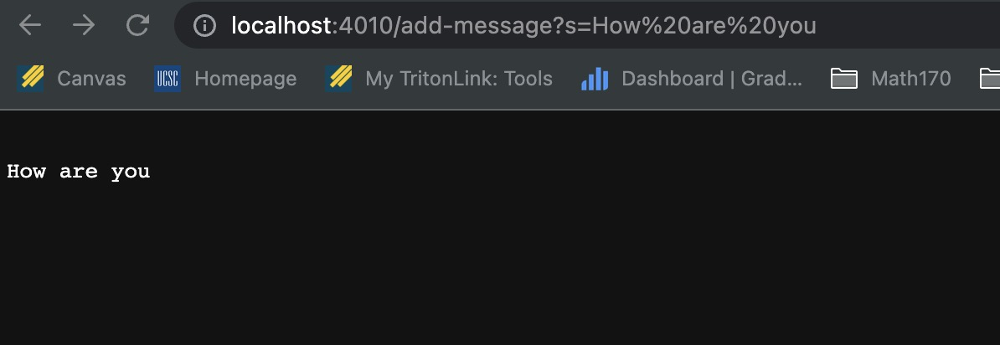
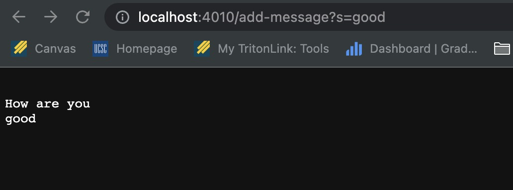
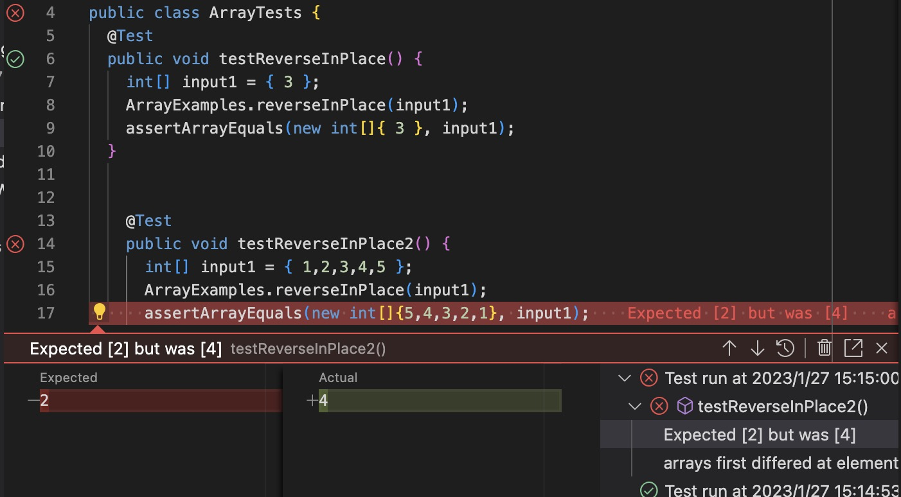

# Lab2
Junhao Qu

## Part 1

**This is the code**
```
public String handleRequest(URI url) {
    if (url.getPath().equals("/")) {
        return ("Add your string here");
    }
        else{
            System.out.println("Path: " + url.getPath());
            if (url.getPath().contains("/add-message")) {
                String[] parameters = url.getQuery().split("=");
                //add to arraylist
                String result = "";
                if (parameters[0].equals("s")) {
                    strings.add(parameters[1]);
                    for(int i = 0; i < strings.size(); i++){
                        result = result + '\n'  + (strings.get(i));
                    }
                }
                return result;
            }
            
        }
        return "404 Not Found!";
    }
}

```
Below is the result when we do /add-message?s=How are you  
We see the website will print the "How are you"  
We call the method 

        handleRequest(URI url)

Passing the String to our String arryalist, so that we could store the value.  
Then for each value we store in the arraylist, we using a new value result to  
store it and print it.

  

Then we do /add-message?s=good  
We see the website print the How are you and good  
We call the same method

        handleRequest(URI url)

Which exact do same thing, we passing the seocnd string to arraylist  
and then using a loop to store it to the result and then return the result.  
  

how the codeflow works, right from when you type in the URL to how the request is handled, what methods are called, how the path is handled, how we get the query parameters, what happens when we don't pass in parameters, what happens if we pass in an invalid url etc.

We called the handleRequest method by passing the url as parameters, First we need to check if it contains "/", if it is not, or invalid, the method will return 404 not found. If it does contain "/add-message", the code splits the query part of the URI using the .split("=") method, which splits the string on the "=" character and returns an array of strings. The resulting array is stored in a variable named "parameters". Next, the code checks if the first element in the "parameters" array is equal to "s". If it is, the second element of the "parameters" array is added to an arraylist named "strings". Finally, the code iterates over the elements in the "strings" array and concatenates them into a single string, which is returned as the result of the method.


## Part 2

1.A failure-inducing input for the buggy program, as a JUnit test and any associated code (write it as a code block in Markdown)
This will caused Junit error.

```
    @Test 
    public void testReverseInPlace2() {
      int[] input1 = { 1,2,3,4,5 };
      ArrayExamples.reverseInPlace(input1);
      assertArrayEquals(new int[]{5,4,3,2,1}, input1);
    }
```    
2.An input that doesn’t induce a failure, as a JUnit test and any associated code (write it as a code block in Markdown)
This will not caused error.

```  
    @Test 
    public void testReverseInPlace2() {
      int[] input1 = {3};
      ArrayExamples.reverseInPlace(input1);
      assertArrayEquals(new int[]{3}, input1);
    }
``` 
3.The symptom, as the output of running the tests (provide it as a screenshot of running JUnit with at least the two inputs above)
we clear see that the there is error message in Junit
We shall get 54321 instead of 54345, it means the list is not reversed as we need.  


4.The bug, as the before-and-after code change required to fix it (as two code blocks in Markdown)  

```
    //This is the Original code
    static void reverseInPlace(int[] arr) {
        for(int i = 0; i < arr.length; i += 1) {
        // here we overwritting the data so it caused bug
        arr[i] = arr[arr.length - i - 1];
        }
    }

    //This is the fixed code
    static void reverseInPlace(int[] arr) {
        for(int i = 0; i < arr.length / 2; i += 1) {
        // we using temp to store the val to avoid overwritting
        int temp = arr[i];
        arr[i] = arr[arr.length - i - 1];
        arr[arr.length - i - 1] = temp;
        }
    }
```

The issue is that in each iteration of the for loop, you are overwriting the value of the current element with the value of the last element, which will cause the original values to be lost. As a result, the final array will only contain the values of the last few elements in the original array, and will not be reversed. 
This bug noticed me maybe I need to use temp value to store the original list, which similar to shallow copy list.


## Part 3
In week 2 and week 3, we learn how to debug using Junit. From the artical  
by John, I learn some usefull skills for debuging. In week 2, I learn how to  
built a simple website, and how to go other mate's webisite and do some 
interesting math.